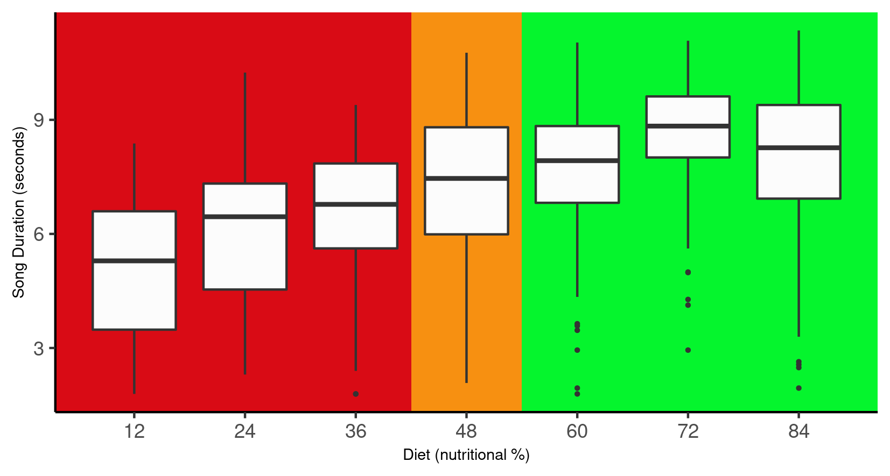

## **Title - Exploring the influence of nutrition on the duration of singing in *Gryllodes sigillatus,* the decorated cricket - does diet quality affect sexual signalling?**

### **By Eloise Malam**

**ABSTRACT:** The male decorated cricket uses a calling song to attract females. This study looks at the influence of nutrition and weight on the length of this sexual signalling displayed by individuals. It was found that crickets with a higher percentage of nutrition in their diets had both a greater weight increase and a greater song duration. This implies that nutrition is an important factor in a cricket's reproductive ability, possibly because the individuals with a better diet have more resources to allocate towards sexual signalling.

### [**Introduction**]{.underline}

### [**Analysis**]{.underline}

When investigating the minimum and maximum data points, a negative value for song duration became apparent. Believing this to be a typing error, I used the absolute values for song duration so as to avoid any impossible values. Only this variable was altered, as negative values are valid for other variables such as weight change.

### [**Results & Discussion**]{.underline}

##### **DIET AND WEIGHT CHANGE**

I hypothesised that the greater the nutritional percentage of a cricket's diet, the more weight it would gain over the course of the observational period. To test this, I compared the weight gain of crickets in the groups of Low, Medium, and High nutrition using a general linear model.

When looking at the two ends of the scale, it was seen that crickets with a diet of high nutritional value (\>60%) gained an average of . , which is

```{r, echo=FALSE}


```

**Fig.1 - LEFT**: The nutritional percentage of a crickets diet compared to its change in weight over the observational period (n=568). The region highlighted in red represent a loss of weight while the green region conversely represents weight gain. The median, interquartile range, and range for each nutritional percentage are respectively illustrated by the middle line, box, and whiskers on their plot. Outliers are represented by circular plots. **RIGHT:** The mean weight change is presented for each nutritional category - low (≤36), medium(=48), and high(≥60). Note when comparing the adjacent graphs that the y-ax are on different scales.

##### **DIET AND SONG DURATION**

Based on the results above which illustrated a greater weight gain in crickets with a better diet, I further hypothesized that the group with higher nutrition would also have a greater song duration due to an increased amount of resources to allocate to the costly action.

```{r, echo=FALSE}


```

### [**References**]{.underline}
