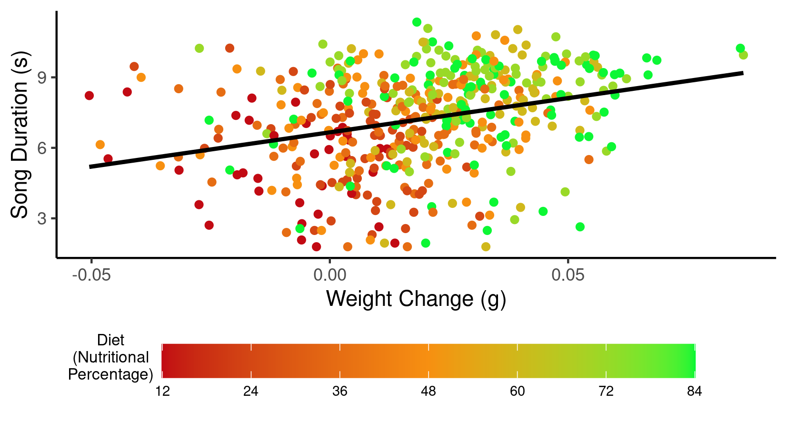

## **Exploring the influence of nutrition on the duration of singing in *Gryllodes sigillatus,* the decorated cricket - does diet quality affect sexual signalling?**

**ABSTRACT:** The male decorated cricket uses a calling song to attract females. This study looks at the influence of nutrition and weight on the length of this sexual signalling displayed by individuals. It was found that crickets with a higher percentage of nutrition in their diets had both a greater weight increase and a greater song duration. This implies that nutrition is an important factor in a cricket's reproductive ability, possibly because the individuals with a better diet have more resources to allocate towards sexual signalling.

### [**Introduction**]{.underline}

*Gryllodes sigillatus* is a species of cricket known by many names including decorated, banded, and tropical house cricket. The signalling song produced by males is facilitated by the orthopteran insect's forewings and antennae and works via the principles of sexual signalling to attract a female mate [@subramaniam1990]. In fact, the song produced can be so alluring to the female that, if other crickets' songs can be heard nearby, a male cricket will increasingly engage in mate guarding behaviours; actions such as isolating the mated female in a burrow work to ensure paternity by preventing the female from mating multiple times [@bateman1999]. Not only does a male's song work to attract females and dissuade possible rival males, but female *Gryllodes sigillatus* crickets exposed to the acoustic displays of their own species reach their full mass quicker than females exposed to either heterospecific songs from different species or no songs at all [@bateman2005]. This would mean that the females are able to reach sexual maturity quicker when in the presence of viable mates.

Due to the importance that sexual signalling has on a cricket's ability to reproduce, this paper aims to look at factors that can influence singing ability, more specifically, the affects of nutrition on male individuals. I hypothesize that males with a more nutritious diet will have a greater increase in weight. As a result of this, I also predict that individuals will sing for a greater duration if their diet has a greater nutritional percentage, as more resources can be allocated to the costly signalling act.

### [**Analysis**]{.underline}

The data-set used to investigate the hypotheses detailed above contains information collected over the course of a week pertaining to male crickets' nutrition, song duration, weight change, and size. R version 4.2.3 [@R] was used to analyse the data and investigate which of the recorded factors influence song duration.

When investigating the minimum and maximum data points, a negative value for song duration became apparent. Believing this to be a typing error, I used the absolute values for song duration so as to avoid any impossible values. Only this variable was altered in such a way, as negative values are valid for other variables such as weight change.

I used an ordinary least squares linear model to analyse song duration, looking at diet and weight change as possible explanatory variables. Interaction terms were removed as they were shown not to have an impact: The removed terms set out relationships between weight change and diet (*F*~1,533~ =1.7576, *P=* 0.1855) as well as weight change and size (*F*~1,533~ =5.3477, *P=* 0.0211). A further term was removed, as the variable describing size was seen to be unnecessary (ANOVA *F*~1,535~ =2.3698, *P=* 0.1243). The data remained in its original form in the model, as a log transformation was found to make a worse-fitting model. The purpose of this model is to test the hypothesis that greater nutrition leads to an increased duration of singing.

A secondary ordinary least squares linear model was created to assess the weight change of crickets with the nutritional percentage of their diet as a categorical predictor. This was done in order to address the hypothesis that diet has an impact on weight change.

### [**Results & Discussion**]{.underline}

##### **DIET AND WEIGHT CHANGE**

I hypothesized that the greater the nutritional percentage of a cricket's diet, the more weight it would gain over the course of the observational period (1 week). To test this, I compared weight change to differing percentages of dietary nutrition using an ordinary least squares linear model where nutritional percentages from 12-84% increasing in increments of 12 were used as a predictor variable for weight change in grams over the course of a week. The changes in weight ranged from a loss of 0.0578g to a gain of 0.0868g, and it was found that a cricket will gain 0.00596 grams [95% CI; 0.00553-0.00639] for each 12% increase in nutrition (Linear Model: *T*~1,537~ =13.9, *P*\<0.001). This confirms the hypothesis and is consistent with established knowledge on diet and nutrition.

REF and STATS

```{r, echo=FALSE}
knitr::include_graphics("../Graphs/dw_means_april23.png")

```

**Fig.1 - LEFT**: The nutritional percentage of a crickets diet (12-84%) compared to its change in weight (grams) over the observational period of one week (n=539). The region highlighted in red represent a loss of weight while the green region conversely represents weight gain. The median, interquartile range, and range for each nutritional percentage are respectively illustrated by the middle line, box, and whiskers on their plot. Outliers are represented by circular plots. **RIGHT:** The mean weight change in grams is presented to 3 significant figures for each nutritional category - Low (≤36%), Medium(=48%), and High(≥60%). Error bars extend one standard deviation above and below the mean.

##### **DIET AND SONG DURATION**

Based on the results above which illustrated a greater weight gain in crickets with a better diet, I further hypothesized that the group with higher nutrition would also have a greater song duration due to an increased amount of resources to allocate to the costly action. To test this, I used an ordinary least squares linear model to compare song duration of crickets consuming diets of differing nutritional percentages, with diet as a predictor variable for total song duration in seconds over a week of observation. This showed that for each percentage increase in nutrition, the cricket sang for 0.031 seconds longer [95% CI; 0.025-0.037], meaning for each 12% incremental increase song duration was extended by 0.37 seconds (Linear Model: *T*~1,536~ =5.26, *P*\<0.001) . Illustrated in Fig. 2, the mean song duration for those with a low nutritional intake (≤36% ) is 4.513 seconds, rising to an average of 7.393 for crickets with a high nutritional intake (≥60%).

This is consistent with previous knowledge, as acoustic production in crickets is a highly energetic process, which would require an abundance of resources derived from diet.

```{r, echo=FALSE}
knitr::include_graphics("../Graphs/dd_means_april23.png")

```

**Fig. 2 - LEFT:** The nutritional percentage of a crickets diet compared to the total length of time (in seconds) spent singing over the observational period of 1 week. The background colours surrounding the boxes show the nutritional category of the diet; red representing Low, orange for Medium, and green for High. The median, interquartile range, and range for each nutritional percentage are respectively illustrated by the middle line, box, and whiskers on their plot. Outliers are shown as circular filled plots. **RIGHT:** The mean song duration in seconds is presented to 4 significant figures for each nutritional category - Low (≤36%), Medium(=48%), and High(≥60%). Error bars extend one standard deviation above and below the mean.

##### **SIGNIFICANCE AND CONCLUSIONS**

Song length is significant as a male cricket's ability to sing for a greater duration than their peers has a great impact on their fitness, something which is facilitated by their nutrition. A longer song would suggest a greater chance of mating through the principles of sexual selection.

Males of a species competing against each other for the opportunity to mate with a female is a common occurrence in nature [@cox1977]. These competitions can manifest as direct antagonism where males get into a physical conflict. Such is the case with red deer, as growing larger antlers to fight with correlates to a greater level of reproductive success [@kruuk2002]. The other way that males can outshine their peers is through courtship displays which are aimed to impress the females, as is true of the singing behaviour found in *Gryllodes sigillatus*. Another well-known example of this includes male birds such as peacocks sporting a large ornamental plumage. In the wild, this colourful addition could be seen as a counter-intuitive for survival, making it more difficult to hide from and escape predators [@burk1982]. The same could be said for the cricket - producing a loud acoustic for an extended time could alert predators to the individual's location. However, this is exactly why it is so attractive to females of the species - If an individual can survive despite their handicap they must be of good fitness, a quality that females will want to pass on to their offspring [@andersson1986].

```{r, echo=FALSE}


```

Fig.3 - The song duration in seconds of male decorated crickets (n=481) in regards to the nutritional percentage of their diet and their change in weight in grams over 1 week. The colour of each point corresponds to the percentage of nutrition in the cricket's diet from 12-84%, on a scale where red=low and green=high.

Due to the reproductive repercussions of song duration, the factors that allow a cricket to sing for longer are highly significant to their fitness and the proliferation of their genes. Subsequently, maintaining a nutritious diet is important for the success of male crickets as it not only facilitates weight gain, but also corresponds to an increased song length, likely due to an increased availabilty of energy to expend. Both of these results increase a male cricket's chance of winning over a mate, as not only are female *Gryllodes sigillatus* attracted to the acoustic displays, they prefer the songs of bigger individuals [@kiflawi2000]. As found in this investigation, bigger crickets produce a longer song on average, so it can be inferred that the song duration is what indicates to the female a male's size and therefore fitness.

### [**References**]{.underline}

This report was produced using R version 4.2.3 [@R] The following packages were used during the data analysis and visualisation process: tidyverse [@tidyverse], colorBlindness [@colorBlindness], rstatix [@rstatix], performance [@performance], MASS [@MASS], broom [@broom] and patchwork [@patchwork].
