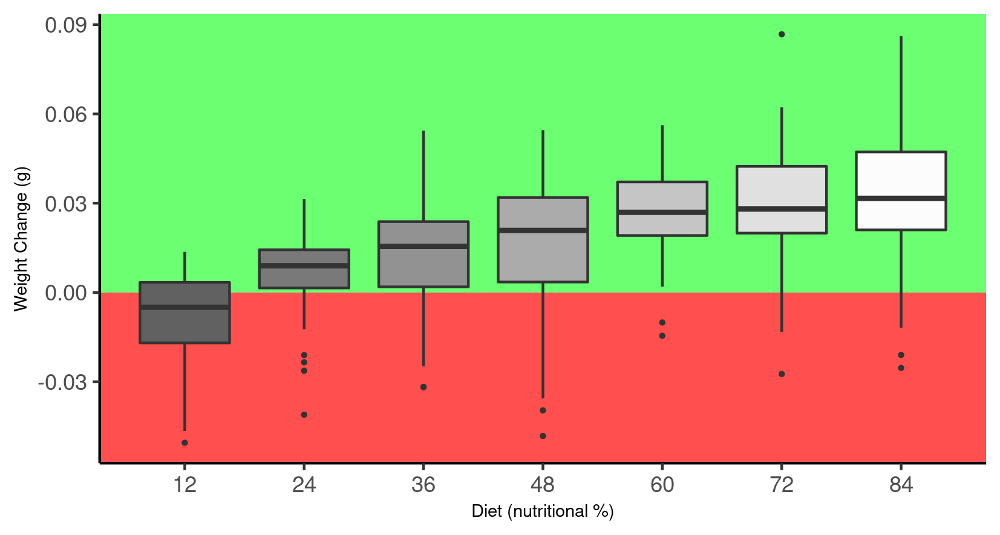

## **Title - Exploring the influence of nutrition on the duration of singing in *Gryllodes sigillatus,* the decorated cricket - does diet quality affect mate signalling?**

### **By Eloise Malam**

**ABSTRACT:** The male decorated cricket uses a calling song to attract females. This study looks at the influence of nutrition and weight on the length of this sexual signalling displayed by individuals. It was found that crickets with a higher percentage of nutrition in their diets had both a greater weight increase and a greater song duration. This implies that nutrition is an important factor in a cricket's reproductive ability, possibly because the individuals with a better diet have more resources to allocate towards sexual signalling.

### [**Introduction**]{.underline}

### [**Analysis**]{.underline}

### [**Results & Discussion**]{.underline}

##### **DIET AND WEIGHT CHANGE**

```{r, echo=FALSE}


```

##### **DIET AND SONG DURATION**

### [**References**]{.underline}
